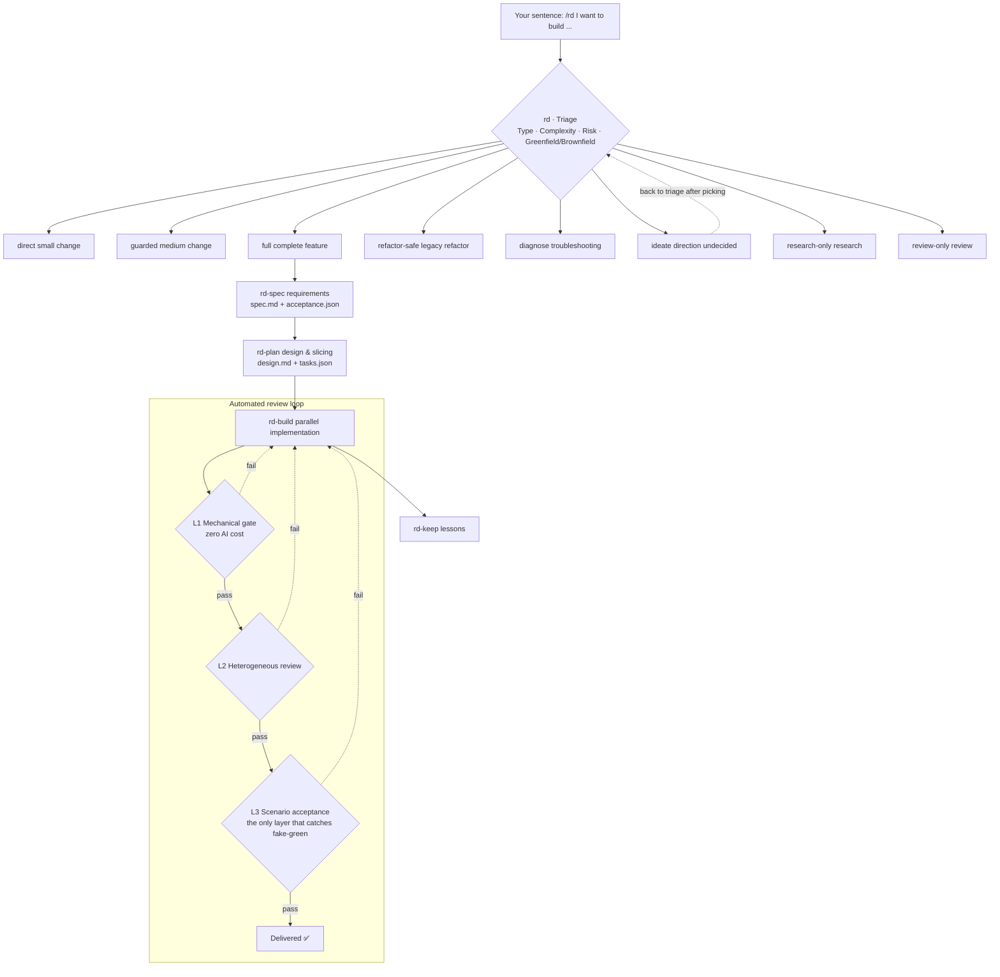

<h1 align="center">🏢 Agent-RD</h1>

<p align="center">
  <strong>One person, an entire R&D department</strong>
</p>

<p align="center">
  A fully automated delivery pipeline for the One-Person Company (OPC)<br>
  You say what you want; AI thinks, writes, reviews, verifies and delivers · Three review gates · The system is written as scripts
</p>

<p align="center">
  <a href="../LICENSE"></a>
  
  
  <a href="https://github.com/bluesxu/agent-rd/stargazers"></a>
</p>

<p align="center">
  <a href="../README.md">简体中文</a> ·
  <b>English</b>
</p>

<p align="center">
  <a href="#quickstart">🚀 Quick Start</a> ·
  <a href="#ideate">🧭 Direction Undecided</a> ·
  <a href="#gates">🚧 Three Gates</a> ·
  <a href="#architecture">🏗️ Architecture</a> ·
  <a href="#routes">🛣️ Eight Routes</a> ·
  <a href="#design">🧠 Core Design</a> ·
  <a href="#boundary">⚠️ Limitations</a>
</p>

---

## 🧩 What a one-person company lacks was never "someone who can code"

Tools that let AI write code for you are everywhere. Coding alone stopped being the bottleneck long ago.

**The real bottleneck: when you're alone, nobody keeps watch for you.**

At a big company, before one line of code reaches main branch, it goes through: review by another engineer, a QA pass, and product sign-off.
Starting a company alone, all three seats are empty — and AI writes code far faster than you could ever backfill them yourself.

So three things are guaranteed to happen:

### 🟢 Tests all green, the feature is fake

To make tests pass, AI adds fake data, adds fallback branches, loosens assertions.
The tests are green; the code is broken. You see a wall of green and assume all is well.

### 🗯️ "I'm done" — and nobody can push back

Because the acceptance criteria were never written in a checkable form. It says "the UX should be good" —
so when AI says it's done, on what grounds do you say it isn't? You're the boss, and also the only acceptor.

### 📑 Two AIs edit the same file; the later one overwrites the earlier

The resulting problem is invisible even to automated review — the reviewer gets the post-overwrite code,
and it looks perfectly normal.

**Agent-RD exists to fill these three empty seats.**

It's not yet another AI that writes code for you. It's a **system of governance**:
code written by AI must first pass review and acceptance by another set of AIs before it ever reaches you.

---

<a id="ideate"></a>
## 🧭 Don't know the direction? Let AI figure it out first

The most expensive accident for a one-person company isn't writing the wrong code — it's **building in the wrong direction**.
Three months of hard work, and you ship something nobody wants.

Big companies have a product review that throws cold water on you. Alone, nobody does.

So Agent-RD can take you even when you only have a vague itch:

```
/rd I want to build a tool for indie developers, but I haven't figured out what yet
```

It clears up the direction for you first:

1. **Scan the present** — where you're stuck, what you've already done, what hurts most in the repo
2. **Send 2~3 AIs to think independently**, merge into 3~5 ranked candidate directions
   (each with: what it is / why it's worth doing / rough cost / risks)
3. **You pick one**, then the real delivery pipeline starts

From "I don't know what to do" to "there's a clear direction" — that's AI's job too.

---

<a id="quickstart"></a>
## 🤖 Copy this and let your Agent install it for you

Don't want to type commands yourself? Paste this **whole line** to any AI coding agent (Claude Code, etc.), and it will read the instructions and install it for you:

```text
Please install Agent-RD for me: https://raw.githubusercontent.com/bluesxu/agent-rd/main/docs/install.md
```

It handles everything, only pausing at checkpoints that touch your environment (actual installation, writing config, which project to initialize into) to wait for your go-ahead.

---

## 🗣️ You only need to say one sentence

```
/rd I want a login feature with lockout policy
```

**After that, your part is over.**

```
Break down →  Design   →  Slice   →  Code in  →  Three    →  Auto-fix  →  Deliver
requirements            tasks      parallel     reviews
   AI        3 AIs        AI       many AIs     3 AIs       AI          ✅
```

- 🤖 **Three AIs each produce a technical design**; the orchestrator AI compares them and picks one
- ✂️ **Tasks are sliced along file boundaries so they never collide**; multiple AIs work in parallel
- 🚧 **Three gates review automatically**; on failure a new AI is dispatched to fix, then the whole flow reruns from the top
- 🔁 **At most three rounds** — if it still fails, it stops and tells you where it's stuck

From one sentence to running code, you never need to nod once in between.

**This is what a one-person company should look like: you only appear at decision points, never on the assembly line.**

---

## 👥 Your org chart

A one-person company isn't "one person doing every job" — it's **one person managing every seat**.
Agent-RD fills out your R&D department's headcount:

| Role | Who does it | What you do |
|---|---|---|
| 📋 Product Manager | AI asks about your requirements, writes checkable acceptance criteria | Answer questions |
| 🏗️ Architect | 3 AIs each draft a design; the orchestrator compares and selects | — |
| 📊 Project Manager | AI slices tasks along file boundaries, checks for conflicts | — |
| 👨‍💻 Engineers ×N | Multiple AIs work in parallel | — |
| ⚙️ CI / Build | Scripts run type checks and tests — no AI tokens spent | — |
| 🔍 Code Reviewer | A different AI reviews; it can look but not touch | — |
| 🧑‍💼 QA / Acceptance | An AI that has never seen the code uses the product like a real user | — |
| 💡 Product Advisor | When the direction isn't set, AI produces candidates for you to pick | Pick one |
| 📚 Knowledge Manager | AI records the pitfalls from this round as lessons, auto-loaded next round | Confirm what to record |
| 👑 **CEO** | **You** | **Decide what's wanted, make the calls, take responsibility** |

**Ten seats. Nine are worked by AI.**

---

<a id="gates"></a>
## 🚧 Three automated review gates

```
Gate 1  Checks that spend no AI tokens
        Run type checks, run tests. Cheapest — put it first: fail early, save money
           ↓ pass
Gate 2  AI reviews the code
        A different AI reviews. Snapshot before review, diff afterward to detect tampering
        It can only look, not edit — and it can't dispatch anyone else
           ↓ no must-fix issues
Gate 3  AI accepts as a user
        An AI that has never seen the code uses the product like a real user would
           ↓ everything passes
        ✅ Delivered
```

**The third gate is the killer move.** 🎯

It can't see the code, can't see the tests, and doesn't know how anything is implemented.
All it holds is the "what counts as done" checklist and a program that runs.

**So it has no choice but to actually use the thing.**

The first two gates look at code; "runs fine but miserable to use" problems only surface when someone plays user for real.
This is the accident one-person companies are most prone to — you know your own product too well to see
how awkward it has become.

---

## 🛡️ What it mechanically blocks

A one-person company's most expensive cost is **rework** — with nobody re-checking your work,
errors keep rolling downstream.

**So it doesn't rely on exhorting the AI — it relies on scripts that hard-block.** Every row below is enforced by code:

| What could go wrong | How it's blocked |
|---|---|
| The command returns success without running a single test case | Require success **and** a specified marker string in the output |
| A criterion has several requirements but only one got checked | One checkpoint per requirement; all must hit to pass |
| Tech stack gets locked in during the requirements phase | Error if requirement text names a language or framework |
| Preconditions for a judgment have nowhere to live | Human-judged criteria must state "under what conditions the comparison counts" |
| The same command flips its result in a different terminal | Error on nested quotes in commands |
| Code gets changed while it's being reviewed | Snapshot before review, diff after |
| The code to review is swamped by dependency directories | Only review files declared in the task list; extra edits listed separately |
| After an interruption, no idea where things stood | The script reports current progress, what's missing, and where it last stopped |
| Interruptions leave orphaned screenshots and logs | Files not referenced by any report are named |
| Progress that should be recorded isn't | Two-way reconciliation between records and files on disk |
| Rules quietly changed mid-check | A rules fingerprint is stored at kickoff and re-verified every time |
| "I alone said it's fine" going unnoticed | Every run prints who issued the conclusion |
| The orchestrator AI freelances outside the process | Seven classes of actions require asking you first; unlogged = violation |
| Review findings rely on gut feeling | Every finding must be tagged with a behavioral condition; the script validates it |

**Not one relies on self-discipline.**

In a company of one, **the system must be written as scripts** — write it as rules, and nobody follows them once things get busy.

---

<a id="architecture"></a>
## 🏗️ Architecture

Agent-RD is not "one skill" — it's **four independent layers**. Each layer solves one class of problem,
and layers hand off to each other through files, not memories.



### ① Triage layer — size the task first, then decide how to do it

`rd` judges four things about your request: **type** (feature / bugfix / refactor / chore / research / review),
**complexity** (S / M / L / XL), **risk** (low / high), and **brownfield vs greenfield**.

Then it picks one of **eight routes**. The decision is written to `dispatch.md`, which forces you to state
"why not the second-best route" in one line: if you can't write it, you weren't choosing — you were picking
whatever looked safest.

**Why this design**: the heaviest route costs **roughly 140K tokens per acceptance criterion**. A one-person
company pays its own token bills; running a three-line bug through the full pipeline costs dozens of times
what the fix is worth. **The strategy must fit the task.**

### ② Pipeline layer — four stages, you appear in only one

```
rd-spec  requirements  → spec.md + acceptance.json
rd-plan  design        → design.md + file-level task DAG
rd-build implementation → contains the three-gate automated loop
rd-keep  lessons        → keep only what's reusable long-term
```

Stages hand off through **files, not memories** — each stage is an independently dispatched agent that reads
the previous stage's artifacts. Deliberately so: state lives on disk, so anyone can resume after an
interruption with no "where was I" memory debt.

**Why this design**: only `rd-spec` needs you. You put what's in your head into words; the rest is AI's job.

### ③ Review layer — three gates, each covering the others' blind spots

The three gates run inside `rd-build` as a loop; on failure a new AI is dispatched to fix, then it reruns from the top:

| Gate | Who reviews | Catches | Cost |
|---|---|---|---|
| **L1 Mechanical** | Scripts | Command errors, format errors, out-of-scope file edits | Zero AI cost — always runs first |
| **L2 Heterogeneous review** | A different AI | Intent drift, cross-module interaction bugs | A weaker reviewer than the author is no review at all |
| **L3 Scenario acceptance** | An AI that never saw the code | "Tests green but the feature is fake" | The only layer that catches fake-green |

**Why this design**: the three gates catch non-overlapping things — L1 is cheap so it always runs first, fail
early and save money; L2 looks at diffs and can't catch "the feature is fake"; L3 doesn't look at diffs, so it
specializes in exactly that. **The lightweight routes drop the latter gates. Whether that's a safe bet is exactly
what triage decides.**

### ④ Foundation layer — the system is written as scripts, not self-discipline

The least visible and most valuable layer. Every "should do, but nobody will" chore became something scripts check:

- **Done markers**: finished files must carry an `RD-DONE` stamp; without one, they count as unfinished —
  "the file exists" ≠ "the file is finished"
- **Structured receipts**: every working AI hands back a receipt with fixed fields (files changed / verification
  output / deviations from the task card). Missing or vague fields → sent back for evidence, never a rewrite
- **Frozen tables**: the three review-severity conditions and receipt fields are reconciled verbatim against the
  script constants — the checking rules themselves must not be quietly changed
- **Progress reconciliation**: records and files on disk are cross-checked both ways; after an interruption it
  tells you what's missing and where it stopped

**Why this design**: a one-person company has no coworker to remind you "you forgot this." Written as prose,
rules die the moment things get busy. **Written as scripts, they apply whether you feel like it or not.**

---

<a id="routes"></a>
## 🛣️ Eight routes — small tasks skip the full pipeline

A one-person company pays its own token bills. So it checks how big the task is first, then picks a route:

| Route | When to use |
|---|---|
| `direct` | A one-or-two-line tweak; just do it |
| `guarded` | Medium change; add one review |
| `full` | A complete feature; all three gates |
| `refactor-safe` | Refactoring existing code; serial by default |
| `diagnose` | Troubleshooting; reproduce first, then fix |
| `ideate` | **Direction undecided; produce ranked candidates for you to pick** |
| `research-only` | Research only; no code |
| `review-only` | Code review only |

**No cannons pointed at mosquitoes.** 🦟

---

<a id="design"></a>
## 🧠 Core design

### 📋 The acceptance checklist is the starting point of the whole flow

To skip human review, the prerequisite is **acceptance criteria that a machine can judge before work begins**.

- **Machine-judged**: first pin down "given what input, expect what output, by what standard of equality",
  translated into concrete commands once the technical design is set
- **AI-judged**: must spell out "which interface to look at", "under what preconditions the comparison counts",
  "what evidence to hand back"

A criterion you can't explain how to check isn't an acceptance criterion — it's a wish. The script blocks it outright.

**This is the foundation on which the whole one-person-company model stands.**
You can't read the code line by line; you can only read conclusions — so those conclusions must be trustworthy.

### 🧪 Passing tests alone don't count

Passing tests only prove "the code matches the tests" — not that the code is right.

So one thing is required: **deliberately break the code and see whether the tests scream.**
Change `>` to `>=`, delete a condition, add one to a constant — break one spot, run once, then revert.
If the tests stay silent, that spot was never covered to begin with.

Measured comparison — same repo, same review round:

```
One module: 6 breaks introduced, 6 caught by tests
Another module: 6 breaks introduced, 0 caught by tests
```

The only difference: the first module's task card said "you must do this"; the second's didn't.

### 📂 Tasks in the same batch may not touch the same file

Two AIs editing the same file, the later overwriting the earlier — automated review can't see that kind of problem.

So tasks are sliced by **file**, not by feature. A script checks whether the file lists of tasks in the same batch overlap.

### 📎 Conclusions must be self-verifiable

Every artifact has to survive the interrogation "who did this, what was verified, and how":

- Every finding in a review must be tagged with a **behavioral condition** (e.g. "the normal path produces a
  wrong result without an error"), never an adjective like "doesn't feel right"
- Every working AI hands back a **structured receipt**; missing fields mean going back for evidence
- Files carry an `RD-DONE` stamp; without one, they're unfinished

This frees your scarcest resource — attention — from babysitting AIs.

---

## 🙋 When you need to step in

What a one-person CEO should save most is attention. In the entire flow, only four moments need you:

| When | Notes |
|---|---|
| 1️⃣ Requirements at step one | Requirements can only come from you; no way around it |
| 2️⃣ The orchestrator AI wants to act outside the flow | Killing a working AI mid-task, changing flow rules, skipping a check — it must ask you first |
| 3️⃣ Confirming which lessons to record at wrap-up | Low-cost confirmation; if you don't respond, it records by its own judgment |
| 4️⃣ Three rounds without passing | Abnormal; a healthy run never triggers this |

Plus one optional: **picking a candidate direction when the direction isn't set.** Otherwise,
go do what only you can do — think about the product, meet customers, collect money. 💰

---

## 🚀 Installed in three minutes

```bash
# Clone to a fixed location (you'll come back here to git pull for upgrades)
git clone https://github.com/bluesxu/agent-rd.git ~/.agent-rd/repo
cd ~/.agent-rd/repo

# Install the skills into ~/.claude/skills/ (existing versions get backed up)
node install.js -Apply

# Optional: turn on Agent Teams (adds one env var to settings.json, backs it up first)
# Only affects which parallel mode rd-build uses; without it, it falls back to parallel subagents
node scripts/enable-agent-teams.js
```

**Restart Claude Code, then type `/rd` followed by what you want.** At this point not a single byte of
your project has been touched — installing only writes into `~/.claude/`.

> The repo can live anywhere, but it must live in a **fixed** location: upgrades happen there via
> `git pull`, and the init script needs its absolute path. If you have no preference, use
> `~/.agent-rd/repo` (`%USERPROFILE%\.agent-rd\repo` on Windows).

**Runs on Windows / macOS / Linux — no tmux, no WSL, no extra CLI tools to install.** 💻
The only runtime is Node.js 22+ — which you already have if Claude Code runs, so there's effectively nothing extra to install.

### One more command when you want the full pipeline in a project

The mechanical gate reads `.rd/gates.json` from the project, and the full pipeline writes its artifacts
into `.rd/`. So **the first time you use it in a given project**, run this once in that project's root:

```bash
cd /your/project
node ~/.agent-rd/repo/scripts/init-rd.js
```

The init script is incremental and won't overwrite existing files. It auto-detects your project's language,
wires up the matching check commands, drops the guard scripts into `.rd/bin/`, then actually runs the configured
commands once to confirm they work. **It doesn't touch your git** — you decide the git policy for `.rd/` and
dependency directories.

**No server to rent, no account to register, no monthly fee. Once installed, it's yours.** 🆓

---

## 🧹 Uninstall is one sentence too

Done with it? Paste this line to any AI coding agent and it will remove only what Agent-RD itself installed:

```text
Please uninstall Agent-RD for me: https://raw.githubusercontent.com/bluesxu/agent-rd/main/docs/uninstall.md
```

**It touches only three places**: the 7 `rd-*` skills in `~/.claude/skills/`, one env var in `settings.json`,
and the repo directory `~/.agent-rd/`. **Your project code and the `.rd/` folders in your projects
(acceptance criteria, designs, reports, lessons...) are never touched.** Reinstall anytime by rerunning the install — everything is idempotent.

---

<a id="boundary"></a>
## ⚠️ Limitations

Said up front, to save you time:

- 💻 **Cross-platform.** The check scripts are Node.js and run on Windows / macOS / Linux. Your project's own check commands (`npm test`, `cargo test`, etc.) just need to run on your platform — that's up to your toolchain.
- 🖥️ **Pure codebases get diminished results.** With no runnable interface or command, gate 3 degrades into an ordinary integration test.
- 💸 **Parallel AIs cost roughly 5× the tokens.** A single AI is more economical for simple CRUD — hence the eight routes.
- 🧪 **Agent Teams is an experimental Claude Code feature**; on Windows, only single-window mode works.
  If unavailable, it first degrades to parallel subagents (still parallel, just no teammate-to-teammate
  messaging), and only then to one-at-a-time execution. Either way the flow doesn't break.

---

## 📁 Directory structure

```
Agent-RD/
├── README.md                  This file in Chinese (简体中文)
├── docs/
│   ├── README_en.md           English README
│   ├── install.md             One-line install instructions for an Agent (the command in the README points here)
│   ├── uninstall.md           Uninstall instructions
│   └── authoring.md           Writing rules for people who modify this framework
├── install.js                Install the workflow into Claude Code (Node, cross-platform)
├── skills/                    The seven workflow skills
│   ├── rd/                    Entry point; sizes the task and picks a route
│   │   ├── strategies/        The eight routes, one file each
│   │   └── references/        Conditionally loaded details
│   ├── rd-spec/               Step 1: gather requirements
│   ├── rd-plan/               Step 2: design and slice tasks
│   ├── rd-build/              Step 3: write code + three checks
│   ├── rd-review/             Gate 2: AI reviews code
│   ├── rd-eval/               Gate 3: AI accepts as a user
│   └── rd-keep/               Step 4: record lessons
├── templates/                 Templates for the various files
└── scripts/                   Guard scripts (zero npm dependencies)
    ├── init-rd.js             Initialize inside a project
    ├── enable-agent-teams.js  Flips the parallel-orchestration switch (only script that writes settings.json)
    ├── gate-l1.js             Gate 1 checks
    ├── check-ac.js            Prevents "command succeeded but tested nothing"
    ├── check-artifacts.js     Checks progress, interruptions, and rule tampering
    ├── freeze-target.js       Snapshot + tamper comparison
    ├── validate-plan.js       Validates acceptance & task list quality
    └── verify.js              Artifact verification
```

What gets generated inside your project:

```
.rd/
├── attention.md              Read first at every kickoff; kept under 30 lines
├── gates.json                Which commands gate 1 runs
├── bin/check-ac.js           Guard script; travels with the project
├── lessons/                  Accumulated lessons
├── ideation/                 Candidate exploration when the direction isn't set (the `ideate` route)
└── features/{feature-name}/
    ├── dispatch.md           Why this route was chosen
    ├── spec.md               Requirements
    ├── spec-internal.md      Internal notes (invisible to the gate-3 AI)
    ├── acceptance.json       Acceptance checklist
    ├── design.md             Technical design
    ├── tasks.json            Task list
    ├── run.json              Run records
    ├── review-target.json    Review snapshot
    └── reports/              Reports and evidence from the three gates
```

**These files should all be committed to git.** They are evidence — when you need to prove
"what exactly was verified back then", this is what you point to.

**A one-person company has no coworker to vouch for you.** These files are your quality archive:
when a customer asks, a partner asks, or you-yourself-six-months-later asks, the answers are all in `reports/`.

---

## ⚙️ Notes for editing the code

The scripts are **Node.js** (`scripts/*.js`, plus `install.js` at the root): built-in modules only, zero npm
dependencies, targeting Node 22+ — the same requirement as Claude Code, so having Claude Code installed is enough.

Only two platform-specific concerns; keep them in mind when editing:

- **Run commands with `spawnSync(cmd, { shell: true })`** — Node picks Windows `cmd` or Unix `sh` automatically. Don't hardcode `cmd /c` / `sh -c`, and don't use cmd-only redirections like `2>NUL`.
- **Join paths with `path.join`, and normalize to `/` separators when comparing** (that's what the out-of-scope check in `freeze-target` does). Don't write `\` by hand in a string.

**Why JSON instead of YAML for configuration**: so the check scripts run with zero dependencies — JSON is built
into Node, YAML needs an extra library. Whether the check scripts can run at all directly decides whether this
workflow can automate.

**Why the floor is Node 22 rather than 18**: `node --test` glob support and ESM syntax auto-detection are
Node 21/22 capabilities. Tests and the syntax gate are the foundation of this pipeline; we can't gamble on
older versions.

---

## 💡 In one sentence

**Others give you an AI employee. Agent-RD gives you a company system that can manage AI employees.**

```
/rd I want to build a ...
```

---

<sub>Keywords: Agent-RD, AI R&D department, One Person Company, OPC, solopreneur, indie hacker, Claude Code, autonomous coding,
AI code review, multi-agent workflow, fully automated programming, prompt-to-product, AI development pipeline,
multi-agent collaboration, automated acceptance, code review automation, acceptance criteria,
mutation testing, Claude Code skills, Node.js, cross-platform, AI direction exploration, ideation.</sub>

---

## 📜 License

[PolyForm Noncommercial License 1.0.0](../LICENSE)

Free for personal use, study, research, and nonprofits. **Any commercial use requires prior written permission** —
including shipping it in a commercial product, offering paid services built on it, or using it inside a company.
For commercial licensing, open an [issue](https://github.com/bluesxu/agent-rd/issues) on GitHub.
